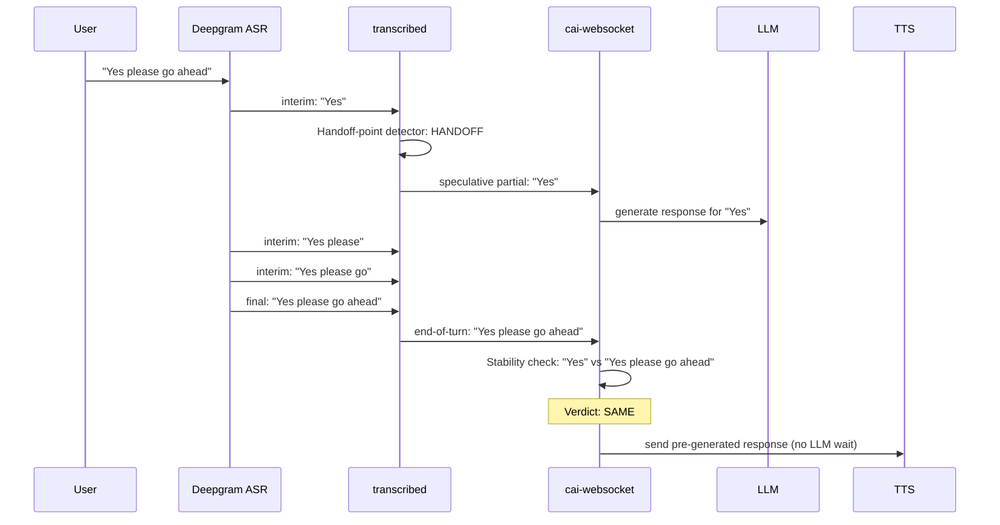
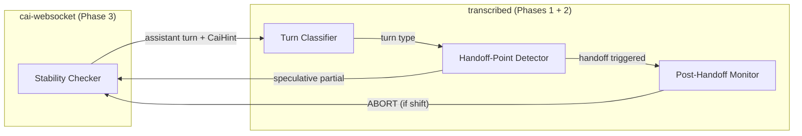
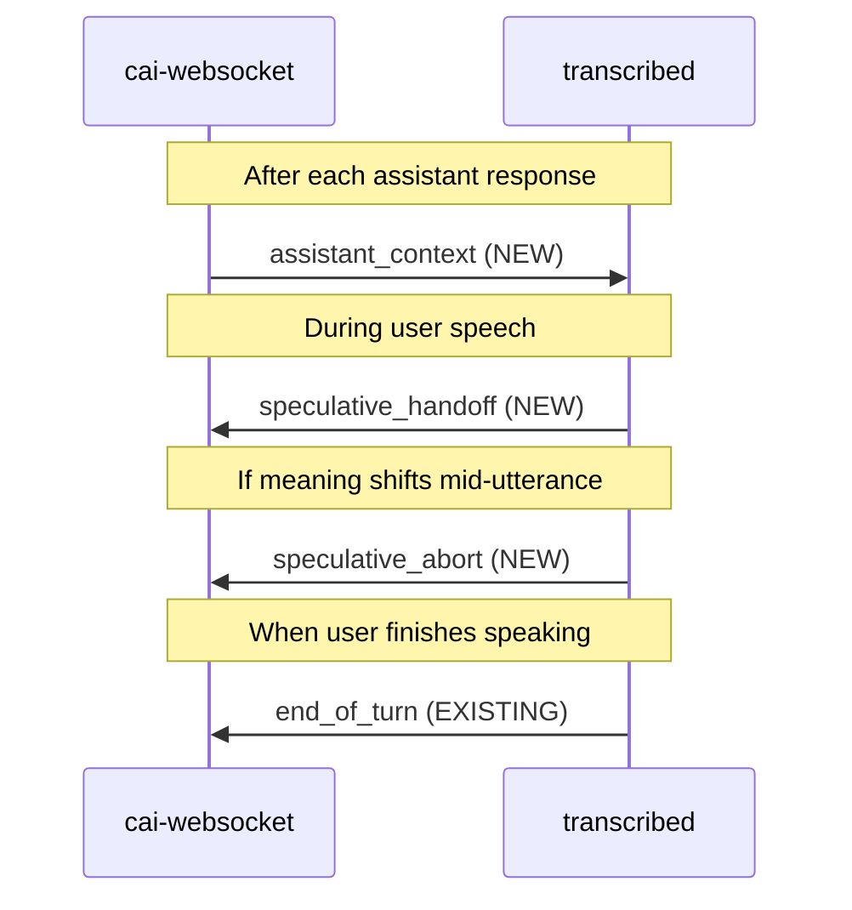
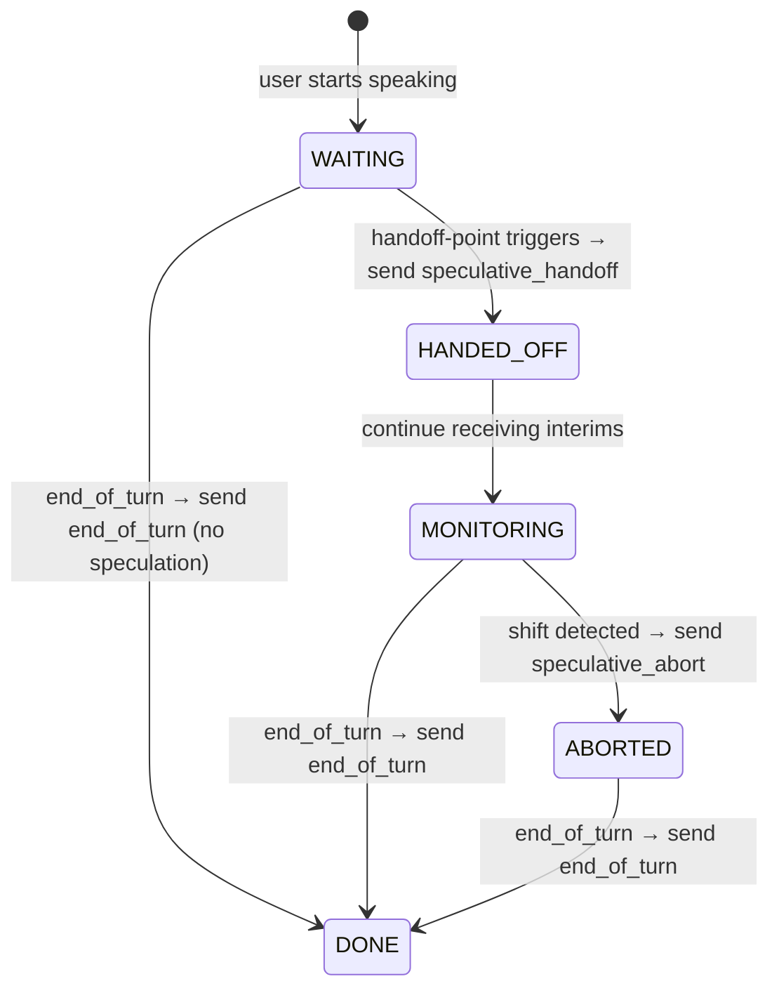
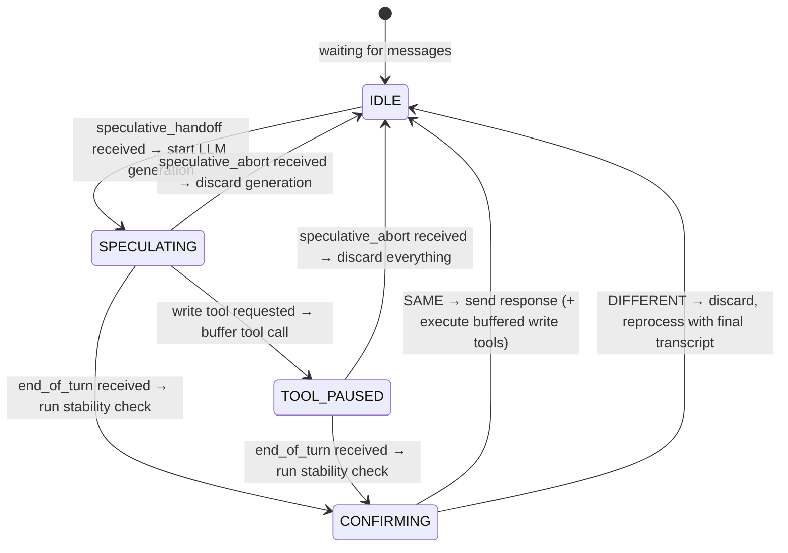
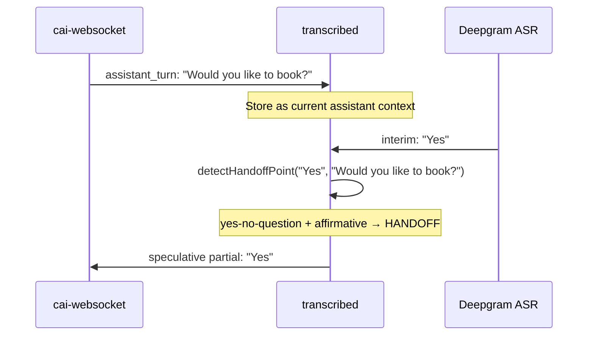
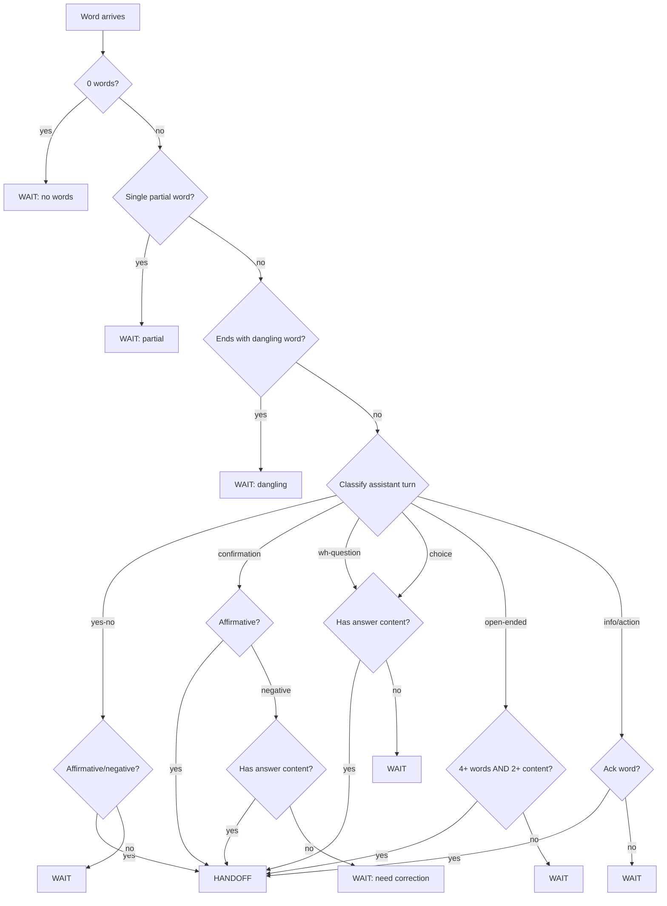
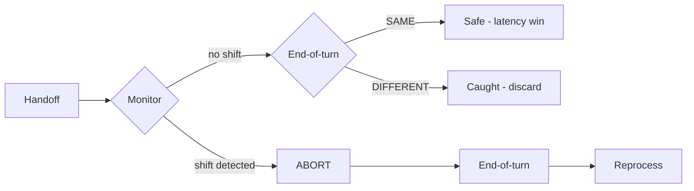
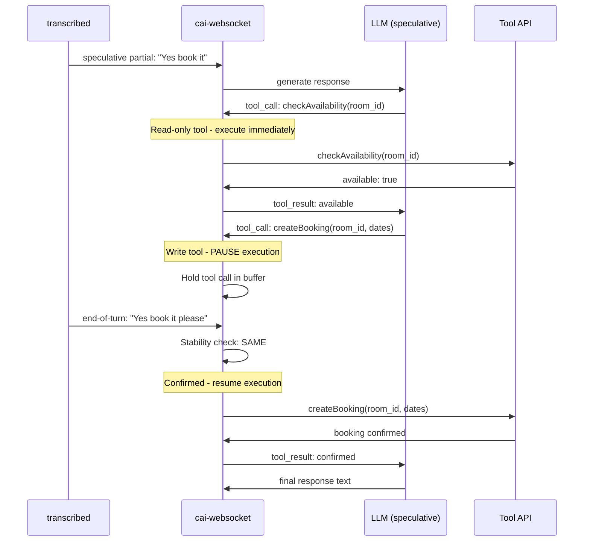
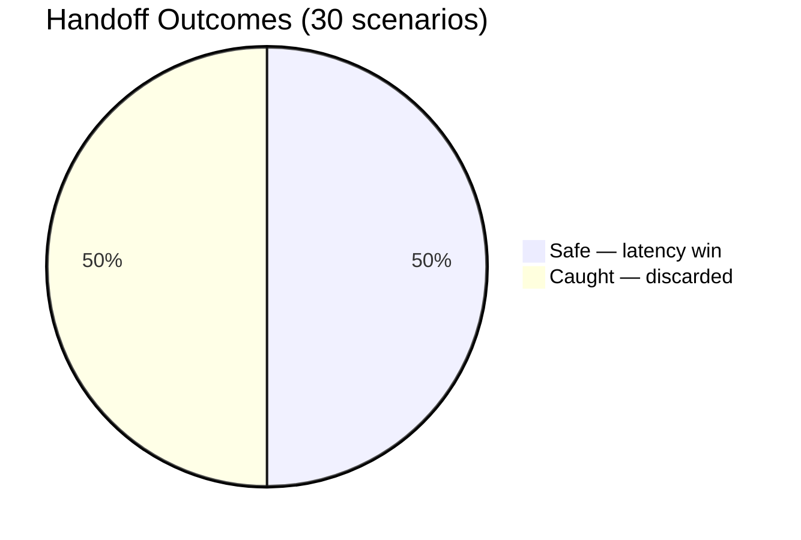

# Speculative Handoff Pipeline — Architecture

## Problem Statement

In a voice AI pipeline, latency between the user finishing speaking and receiving a response is the critical metric. The current flow is:

```
User speaks → Deepgram ASR → transcribed (end-of-turn) → cai-websocket → LLM → TTS → User hears response
```

LLM generation is the biggest latency contributor. We cannot start it until end-of-turn is confirmed, because we need the full utterance. But often the user's *meaning* is clear well before they finish speaking — "**Yes** please go ahead" has its answer at word 1.

The platform already has a **turn-detect model** in transcribed that identifies the natural end of a turn and triggers faster handoff to cai-websocket, rather than waiting for VAD silence timeout alone. This works well for longer utterances where the model has enough context to recognise a completed thought. But short responses - "Yes", "No", "OK", "Berlin" - are inherently difficult for turn-detect. A single word offers almost no linguistic signal to distinguish a complete turn from a mid-sentence pause. These short responses fall back to **VAD silence detection** (600ms+), creating a 1-2 second penalty on exactly the responses that should be fastest:

```
"Would you like to proceed?" → User says "Yes" (200ms)
                              → Turn-detect: insufficient signal
                              → VAD waits for silence ... (600-1000ms)
                              → end-of-turn confirmed
                              → LLM starts generating (~1500ms)
                              → TTS starts
Total dead time: ~2-2.5s after the user finished speaking
```

The speculative handoff pipeline targets this gap. The handoff-point detector doesn't need to solve end-of-turn detection - it recognises "Yes" as a complete **answer** to a yes-no question on the interim transcript, before either turn-detect or VAD has confirmed end-of-turn. By the time end-of-turn arrives, the LLM response is already generated and waiting.

## Solution: Speculative Handoff

Send partial utterances to the LLM **before** end-of-turn, generating a response speculatively. When the final transcript arrives, check if it means the same thing. If yes, send the pre-generated response immediately. If no, discard and reprocess normally.



**Key constraint**: false positives (wrong response sent) are unacceptable. False negatives (missed opportunity, normal latency) are fine. The stability checker is the safety net - it always runs before any response reaches the user.

## Three-Phase Architecture

The pipeline has three phases that run across two services:



| Phase | Service | Question | When | Speed Budget |
|-------|---------|----------|------|--------------|
| **1. Handoff-Point Detection** | transcribed | "Should I send this partial to cai-ws now?" | Every interim transcript | < 1ms |
| **2. Post-Handoff Monitoring** | transcribed | "Has the meaning shifted since I handed off?" | Every interim after handoff | < 1ms |
| **3. Stability Check** | cai-websocket | "Does the handoff partial mean the same as the final?" | End-of-turn | < 1ms |

All three must be **pure heuristic** - no model inference, no network calls. Sub-millisecond is mandatory.

The key insight is that transcribed doesn't stop after the handoff. It continues receiving interims and monitors them for meaning shifts. If the user says "Yes" (handoff) then "actually no wait" (shift), the post-handoff monitor catches this mid-utterance and sends an ABORT - cancelling the speculative generation before end-of-turn. This gives cai-websocket a head start on reprocessing.

### Entry Points

| Phase | Function | Location | Signature |
|-------|----------|----------|-----------|
| **1. Handoff-Point** | `detectFirePoint()` | `src/fire-point/detector.ts:139` | `(partialUtterance, assistantPriorTurn, caiHint?) → FirePointDecision` |
| **1. Turn Classifier** | `classifyAssistantTurn()` | `src/fire-point/turn-classifier.ts:142` | `(turn) → AssistantTurnType` |
| **3. Stability** | `TokenDeltaHeuristicStrategy.compare()` | `src/strategies/token-delta-heuristic.ts:73` | `(interim, final, context?) → StabilityResult` |

### Messaging Between Services

The speculative handoff pipeline requires three new message types between cai-websocket and transcribed, plus relies on one existing message:



#### cai-websocket → transcribed

| Message | When | Payload | Purpose |
|---------|------|---------|---------|
| `assistant_context` | After each assistant response is delivered to the user | `{ text: string, hint?: CaiHint }` | Gives transcribed the conversational context needed for handoff-point detection. Transcribed holds this as state until the next assistant turn replaces it. |

#### transcribed → cai-websocket

| Message | When | Payload | Purpose |
|---------|------|---------|---------|
| `speculative_handoff` | Handoff-point detector triggers | `{ partial: string, turnType: string, confidence: number }` | The partial utterance that the detector considers a complete-enough answer. cai-websocket starts speculative LLM generation. Sent **once** per user turn (first trigger only). |
| `speculative_abort` | Post-handoff monitoring detects meaning shift | `{ partial: string, reason: string }` | Tells cai-websocket to discard the speculative generation immediately. Faster than waiting for end-of-turn stability check. Sent at most once, only after a `speculative_handoff`. |
| `end_of_turn` | VAD silence or turn-detect confirms end of turn | `{ transcript: string }` | **Already exists.** cai-websocket runs the stability checker against the handoff partial. If SAME, send pre-generated response. If DIFFERENT, discard and reprocess. |

#### State Machine in transcribed

Transcribed maintains a per-call state machine for each user turn:



- **WAITING** - receiving interims, running handoff-point detector on each one
- **HANDED_OFF** - speculative partial sent, transition immediately to MONITORING
- **MONITORING** - checking each new interim for meaning shifts against the handed-off partial
- **ABORTED** - abort sent, passively waiting for end-of-turn (no further action until next turn)
- **DONE** - end-of-turn sent, reset state, wait for next `assistant_context`

#### State Machine in cai-websocket

cai-websocket also tracks the speculative execution state:



## Phase 1: Handoff-Point Detector

**Location**: `src/fire-point/detector.ts`
**Runs in**: transcribed service
**Input**: partial utterance (from Deepgram interim), assistant's prior turn
**Output**: handoff/wait decision with confidence and reason

### Conversational Context Dependency

The handoff-point detector cannot work from the partial utterance alone. "Yes" is a complete answer to "Would you like to book?" but meaningless after "How can I help?". The detector **must** know what the assistant last said.

This creates a data flow requirement: **cai-websocket must send the assistant's last turn back to transcribed** after each assistant response. Transcribed holds this as state and uses it for every subsequent interim transcript until the next assistant turn replaces it.



In addition to the raw text of the assistant's last turn, cai-websocket can optionally send a **CaiHint** - structured metadata about what the assistant is expecting. For example, if the assistant asked for an account number, the hint includes the expected code pattern (digit count, format). This allows the detector to apply specialised matching logic (e.g. ASR normalisation of word-numbers to digits) rather than relying on generic content-word detection.

```typescript
interface CaiHint {
  codePattern?: {
    type: 'account-number' | 'sort-code' | 'uk-postcode' | 'phone-uk' | ...;
    minLength?: number;
    maxLength?: number;
    label?: string;
  };
}
```

Without the assistant context, the detector would either be too aggressive (handing off on every content word) or too conservative (waiting for arbitrary word thresholds regardless of what was asked). The assistant's prior turn is what makes context-aware handoff possible.

### Turn Classification

The detector's first step is classifying the assistant's last turn to determine what kind of answer is expected. This is the core insight - what counts as "enough to hand off" depends entirely on the conversational context.

**Location**: `src/fire-point/turn-classifier.ts`

| Turn Type | Example | What's Enough to Handoff |
|-----------|---------|----------------------|
| `yes-no-question` | "Would you like to book?" | Single affirmative/negative word |
| `confirmation` | "So that's 3 nights, correct?" | Affirmative: handoff immediately. Negative: wait for correction content |
| `wh-question` | "What city?" | One answer-word (entity, number, name) |
| `choice-question` | "Standard or premium?" | One answer-word matching a choice |
| `open-ended` | "How can I help?" | 4+ words with 2+ content words |
| `information` | "Your balance is £42" | Acknowledgement word (OK, thanks, perfect) |
| `action-complete` | "I've booked that for you" | Acknowledgement word |

Classification uses regex pattern matching with language-specific patterns (EN + DE). Patterns are checked in priority order to avoid misclassification:

```
open-ended → wh-question → choice → confirmation → yes-no → action-complete → information
```

This ordering prevents "What city **would you** like?" matching `yes-no` before `wh-question`.

### Decision Flow



### Safety Checks

Three checks run before the turn-type logic:

1. **Partial word detection** - Single words ≤4 chars ending in double consonant (e.g. "Ber" for "Berlin") are likely ASR partials. Never handoff.

2. **Dangling word detection** - If the last word is a preposition, determiner, or conjunction ("to", "the", "and"), more is clearly coming. Never handoff.

3. **Answer content filtering** - For wh/choice questions, the content word must be a real answer, not a contraction ("I'd", "I'm") or question word ("What's", "How"). Prevents handoff on framing words.

### Word Lists

**Location**: `src/word-lists.ts`

| List | Purpose | Safety |
|------|---------|--------|
| `FILLER_WORDS` | Words that never change meaning (fillers, pronouns, auxiliaries) | Conservative — missing a filler is safe (FN), wrong filler is dangerous (FP) |
| `NEGATION_MARKERS` | Words that signal reversal (not, never, cancel) | Intentionally **excluded** from fillers in German |
| `REVERSAL_PHRASES` | Multi-word patterns that always mean DIFFERENT ("actually no", "doch nicht") | Checked against full utterance |
| `ADDITION_MARKERS` | Topic-shift signals ("also", "and can you") | Only trigger DIFFERENT with 3+ following content tokens |
| `DANGLING_WORDS` | Prepositions/determiners/conjunctions that expect a complement | Used by handoff-point detector only |
| `AFFIRMATIVES` / `NEGATIVES` | Strong yes/no signals per language | Used by handoff-point detector only |

## Phase 2: Post-Handoff Monitoring

**Location**: `fire-point-report.ts` (detectPostFireShift function)
**Runs in**: transcribed service
**Input**: handoff partial, current partial (each new interim after handoff)
**Output**: shift/no-shift decision

After the handoff-point detector fires (Phase 1), transcribed continues receiving interim transcripts from Deepgram. Rather than ignoring these, it monitors them for **meaning shifts** - cases where the user's intent changes after the point we handed off.

### Why Monitor?

Consider: "Yes" → handoff → "actually no, can you change it to Saturday?"

Without monitoring, we wait until end-of-turn (2+ seconds later), then the stability checker catches it and reprocesses. With monitoring, we detect "actually no" within ~1 word of it being spoken and immediately send an ABORT. cai-websocket can discard the speculative generation and start reprocessing before end-of-turn arrives.

### Shift Detection

The monitor is deliberately **less sensitive** than the full stability checker. It only flags genuine meaning shifts, not incremental content:

| Signal | Example | Action |
|--------|---------|--------|
| **Reversal phrases** | "actually no", "wait no", "never mind" | ABORT immediately |
| **Qualification markers + content** | "but can you change...", "except the date" | ABORT - new constraint added |
| **Addition markers + 2+ content words** | "and also book me a table" | ABORT - new topic |
| **Negation after affirmative** | "Yes" → "not that one" | ABORT - reversal |

Things that do **not** trigger ABORT:
- Filler elaboration: "Yes" → "Yes please go ahead" (just reinforcement)
- Closing words: "Thanks goodbye" after an acknowledgement
- Harmless idioms: "Sure why not" (the "not" isn't negation)
- Tail-position politeness: "No I left it at home sorry" ("sorry" isn't a shift)

### Four Possible Outcomes



| Outcome | What Happened | User Impact |
|---------|--------------|-------------|
| **Safe** | Handed off, monitoring clean, stability SAME | Latency win - pre-generated response sent |
| **Aborted** | Handed off, monitoring caught shift mid-utterance | Earlier catch than waiting for end-of-turn |
| **Caught** | Handed off, monitoring clean, but stability caught change at end-of-turn | Normal latency - safety net worked |
| **No handoff** | Detector never triggered | Normal latency - conservative, no risk |

## Phase 3: Stability Checker

**Location**: `src/strategies/token-delta-heuristic.ts`
**Runs in**: cai-websocket service
**Input**: handoff partial, final utterance, conversation context
**Output**: SAME or DIFFERENT verdict with confidence

### Algorithm

1. **Extract delta** — find the tokens added between partial and final
2. **No delta** → SAME (identical utterances)
3. **Partial-word completion** → SAME (ASR artefact: "Ber" → "Berlin")
4. **Reversal phrases** → DIFFERENT (always, highest priority)
5. **Negation markers** → DIFFERENT (if dominant in delta)
6. **Addition markers + content** → DIFFERENT (topic shift)
7. **Context-aware check** — use assistant turn type:
   - Yes-no/confirmation: if partial has yes/no, delta is elaboration → SAME (unless it has qualification like "but")
   - Information/action-complete: if partial is acknowledgement, delta is elaboration → SAME (unless it has a new request)
   - Wh/choice/open-ended: fall through to context-free check
8. **Filler ratio** — if all delta tokens are fillers → SAME; if content tokens present → DIFFERENT

### Precision Over Recall

The stability checker is deliberately conservative:

| Metric | Value | Meaning |
|--------|-------|---------|
| **Precision** | 100% | Zero false positives — never says SAME when meaning changed |
| **Recall** | 43.7% | Misses some SAMEs — says DIFFERENT for "Perfect" → "Perfect, that's great" |
| **FP (dangerous)** | 0 | No wrong responses |
| **FN (safe)** | 120 | Missed latency savings, normal processing |

False negatives cluster in two patterns:
- **Farewell elaboration**: "Thank" → "Thank you goodbye" — "goodbye" isn't a filler
- **Implicit category words**: "Italian" → "Italian food" — "food" is technically content

Both are safe to miss — they add latency but never send wrong responses.

## Speculative Tool Execution

When the speculative LLM generates a response, it may include tool invocations (function calls). These must be handled carefully - **no data mutation may occur until the speculative handoff is confirmed**.

### Tool Classification

Every tool available to the LLM must be classified as either **read-only** or **write**:

| Classification | Examples | Speculative Behaviour |
|----------------|----------|----------------------|
| **Read-only** | Account lookup, balance check, order status, availability search | Execute immediately - no side effects |
| **Write** | Book appointment, update address, cancel order, transfer funds, send SMS | **Pause** - hold until confirmed |

### Execution Flow



### Write Tool Pause Rules

1. **On write tool call**: Buffer the tool invocation. Do not execute. Pause the LLM stream.
2. **On stability SAME**: Resume - execute the buffered write tool, feed result back to LLM, continue generation.
3. **On stability DIFFERENT** (or ABORT): Discard the entire speculative execution including the buffered tool call. Reprocess with the final transcript from scratch.
4. **On timeout**: If end-of-turn hasn't arrived within a configurable window (e.g. 10s), discard the speculative execution. This prevents indefinite resource holding.

### Read-Only Tool Chains

Read-only tools can execute freely during speculation, even in chains:

```
LLM: tool_call → getAccount(id)         ← read-only, execute
LLM: tool_call → getBalance(account)     ← read-only, execute
LLM: "Your balance is £42..."           ← stream response
```

This is safe because read-only tools have no side effects. If the speculative handoff is later discarded, no state was changed.

### Mixed Chains (Read then Write)

When a speculative chain hits a write tool after read-only tools:

```
LLM: tool_call → getAccount(id)         ← read-only, execute ✓
LLM: tool_call → getBalance(account)     ← read-only, execute ✓
LLM: tool_call → transferFunds(from, to) ← write, PAUSE ⏸
     ... wait for stability confirmation ...
```

The read-only results are already computed and cached. On SAME confirmation, the write tool executes and the LLM continues with all prior context intact. On DIFFERENT, everything is discarded - the read-only calls were harmless.

### Idempotency Consideration

Even after stability confirmation, write tools should ideally be **idempotent** or use request deduplication tokens. In edge cases (network retries, race conditions), a confirmed write tool might be invoked more than once. This is a general API design concern, not specific to speculative execution, but it becomes more important here.

### cai-websocket Responsibility

Tool classification lives in **cai-websocket**, not in the LLM or transcribed:

- cai-websocket already manages tool definitions and routing
- It knows which tools mutate state (from tool metadata or a static registry)
- The LLM doesn't know it's running speculatively - it just calls tools as normal
- transcribed doesn't know about tools at all - it only handles handoff-point detection

This keeps the architecture clean: transcribed decides **when** to handoff, cai-websocket decides **what's safe to execute** during speculation.

## Combined Pipeline Results

Across 30 test scenarios (EN + DE), covering yes-no, wh-questions, confirmations, open-ended, information, choice:

| Metric | Value |
|--------|-------|
| **Handoff rate** | 100% (30/30 scenarios) |
| **Safe handoffs (latency win)** | 15 (50%) |
| **Caught handoffs (no harm)** | 15 (50%) |
| **Wrong responses** | **0** |
| **Avg handoff point** | 48% through utterance |
| **Avg latency saved** | 52% of utterance duration |
| **Decision latency** | 0.09ms avg |

### Outcome Categories



- **Safe**: Handed off early, stability confirmed SAME. Pre-generated response sent immediately - latency saved.
- **Caught**: Handed off early, but meaning changed. Stability checker caught it - response discarded, reprocessed normally. No worse than today.
- The system **never** sends a wrong response. The worst case is normal latency (no savings).

## Language Support

Both phases support English and German with separate:
- Filler word lists
- Negation markers and reversal phrases
- Turn classifier patterns
- Affirmative/negative word sets
- Dangling word sets

Language detection is automatic via character and keyword heuristics (`[äöüß]`, common German function words).

## File Map

```
tools/semantic-stability-tester/
├── fire-point-test.ts              # CLI: run handoff-point scenarios
├── fire-point-report.ts            # HTML report generator
├── index.ts                        # CLI: run stability corpus evaluation
├── src/
│   ├── fire-point/
│   │   ├── detector.ts             # Phase 1: handoff-point decision logic
│   │   ├── turn-classifier.ts      # Classifies assistant turn type
│   │   ├── simulator.ts            # Connects all phases for testing
│   │   ├── scenarios.ts            # 30 test scenarios (EN + DE)
│   │   └── types.ts                # HandoffPointDecision, HandoffPointScenario, etc.
│   ├── strategies/
│   │   ├── token-delta-heuristic.ts  # Phase 3: stability checker (winner)
│   │   ├── embedding-similarity.ts   # Evaluated — too coarse, 8 FP
│   │   ├── nli-entailment.ts         # Evaluated — unreliable, 12 FP
│   │   ├── entity-diff.ts            # Evaluated — 24 FP
│   │   └── hybrid.ts                 # Evaluated — 2 FP
│   ├── word-lists.ts               # Filler, negation, reversal, addition lists
│   ├── corpus/
│   │   ├── en.ts                   # 60 handcrafted EN pairs
│   │   └── de.ts                   # 38 handcrafted DE pairs
│   ├── corpus-builder.ts           # MultiWOZ 2.2 corpus generator (429 pairs)
│   ├── evaluator.ts                # Strategy evaluation framework
│   ├── csv-reporter.ts             # CSV/console output
│   └── types.ts                    # Shared types (StabilityStrategy, etc.)
├── corpus/
│   └── generated-en.json           # Generated MultiWOZ corpus
├── results/                        # CSV results + HTML reports
└── docs/
    └── ARCHITECTURE.md             # This document
```

## Running

```bash
# Handoff-point detector test (30 scenarios)
bun run fire-point-test
bun run fire-point-test:verbose

# Handoff-point HTML report
bun run fire-point-report

# Stability checker evaluation (527 pairs)
bun run stability-test:heuristic

# Build MultiWOZ corpus
bun run stability-build-corpus
```

## Strategy Evaluation Summary

Five stability strategies were evaluated. Only the token-delta-heuristic achieved zero false positives:

| Strategy | Accuracy | FP (dangerous) | Latency |
|----------|----------|----------------|---------|
| **token-delta-heuristic** | **77.2%** | **0** | **~0ms** |
| hybrid (heuristic + NLI + entity) | 87.8% | 2 | ~150ms |
| entity-diff (BERT NER) | 74.5% | 24 | ~120ms |
| nli-entailment (MobileBERT) | 73.5% | 12 | ~200ms |
| embedding-similarity (MiniLM) | 62.2% | 8 | ~50ms |

The heuristic wins because:
1. **Zero FP** — the only metric that matters for production safety
2. **Sub-millisecond** — no model inference, pure string/token analysis
3. **No dependencies** — no ONNX runtime, no model downloads, no GPU
4. **Deterministic** — same input always produces same output

Model-based strategies add latency and reduce precision. They're good at catching more SAMEs (higher recall), but allow false positives which are unacceptable.

## Design Decisions

### Why not use an LLM for stability checking?

Too slow (100ms+) and non-deterministic. The stability check runs on every end-of-turn, so it must be sub-millisecond. A heuristic that's conservative (misses some SAMEs) is better than a model that's occasionally wrong.

### Why classify the assistant turn?

"Yes" after "Would you like to book?" is a complete answer. "Yes" after "How can I help?" is just a greeting. Without knowing what was asked, you can't judge whether the partial is sufficient. Turn classification is the key insight that makes handoff-point detection work.

### Why not handoff on every word?

Most words don't change the handoff decision. Once "Yes" is detected after a yes-no question, every subsequent word would also trigger. But transcribed should only send **once** - the first moment the partial is worth sending. After that, it continues listening for end-of-turn.

### Why pause on write tools instead of blocking all tools?

Read-only tools are free latency wins. If we're speculatively generating and the LLM needs to look up an account balance before responding, blocking that lookup wastes the entire speculation benefit. Read-only tools have no side effects - if the speculation is discarded, nothing happened. Only write tools (mutations, bookings, transfers) carry risk, so only they need gating. This maximises the latency savings from speculation while maintaining the zero-harm guarantee.

### Why three-way outcomes instead of binary safe/unsafe?

"Caught" handoffs (stability says DIFFERENT) are **not failures**. They're working as designed - cai-websocket correctly identifies the meaning changed and reprocesses. Reporting them as "unsafe" was misleading. The three-way model:
- **Safe** = latency win (the goal)
- **Caught** = no harm, no win (safety net worked)
- **No handoff** = no attempt (conservative detector)
